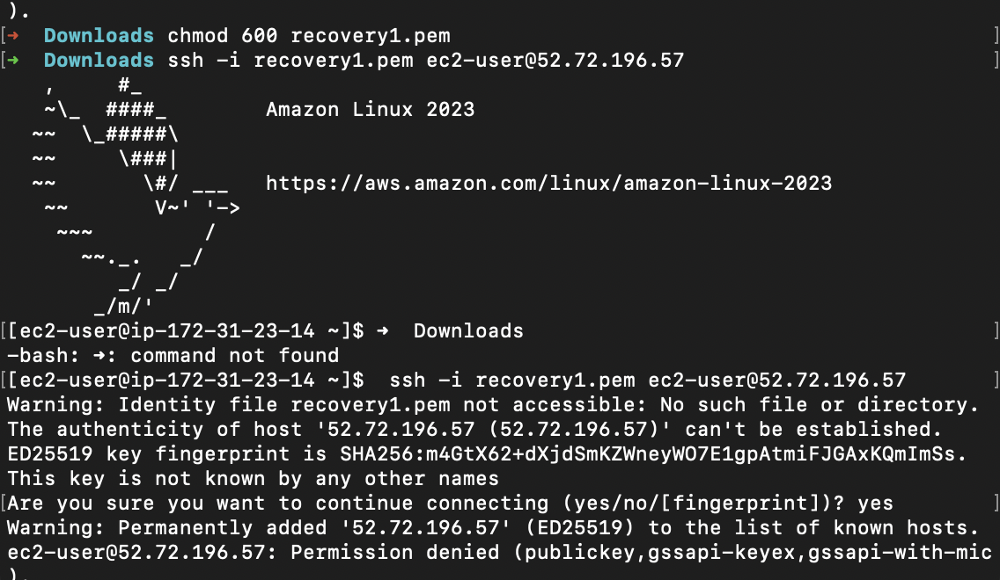
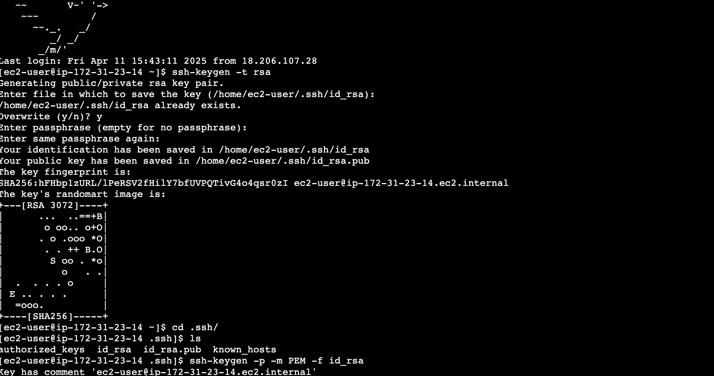
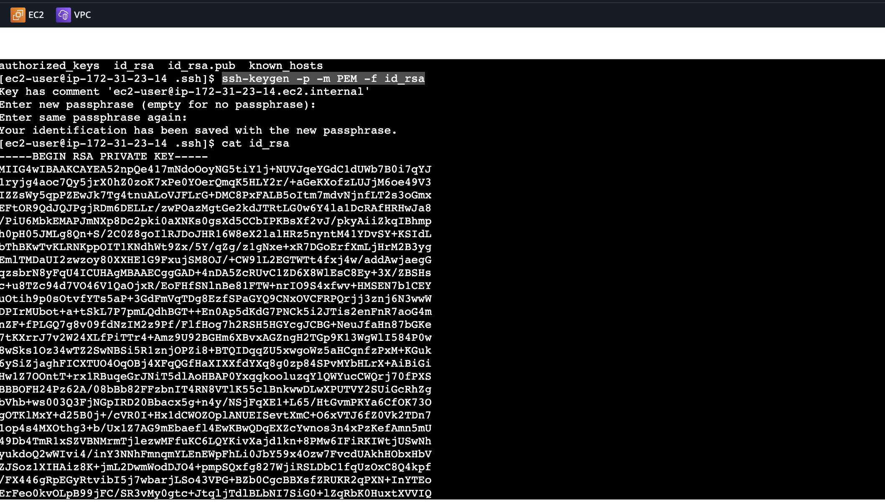
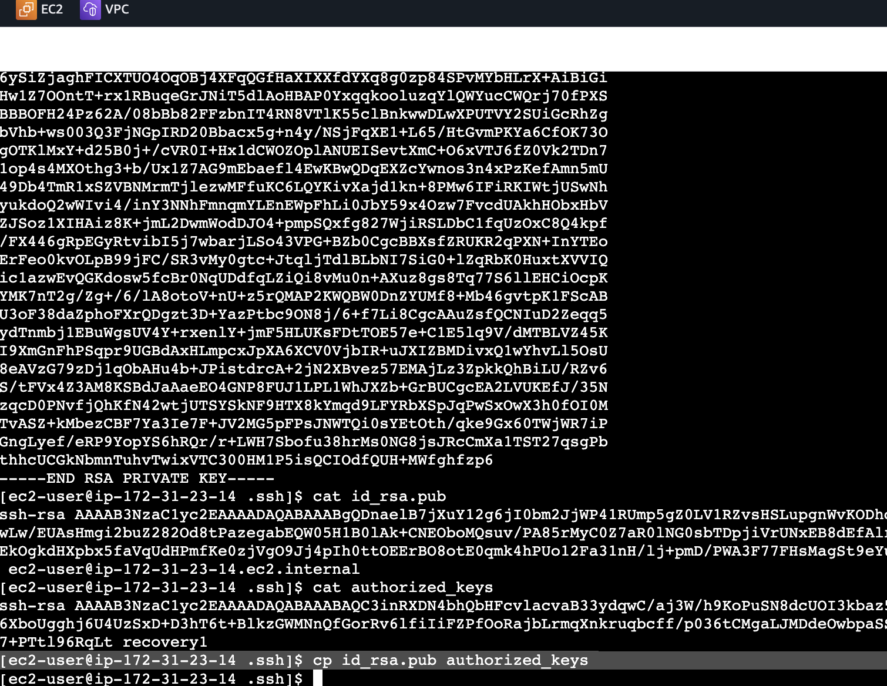
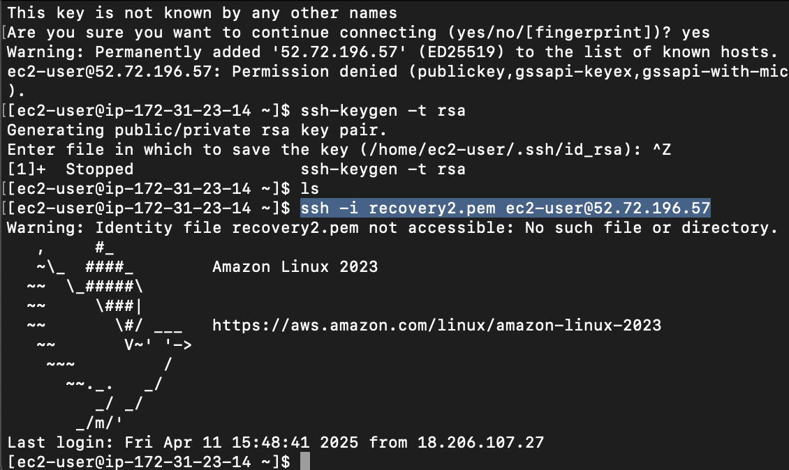

# AWS

### Topic : Key Recovery
#### Recover lost ssh key and regain access to ec2 instances without downtime

#### 1-Launch an Instance

#### 2-Access the instance using terminal ssh -i keypair ec2-user@IP address.Now the connection get established.

#### 3-After that delete the private key from the local and again try to access the instance

#### 5-Access the instance through direct connect and generate the key using ssh-keygen -t rsa

#### 6- Keys are generated.View the private key.Key will be in OPENSSH format

#### 7- Convert key to RSA format-  ssh-keygen -p -m PEM -f id_rsa

#### 8- Now copy the converted key and save it in a file as pem format
#### 9- copy the new public key to authorized_keys where your old lost public key was present.

#### 10- Now access the instance via terminal using the new private key
