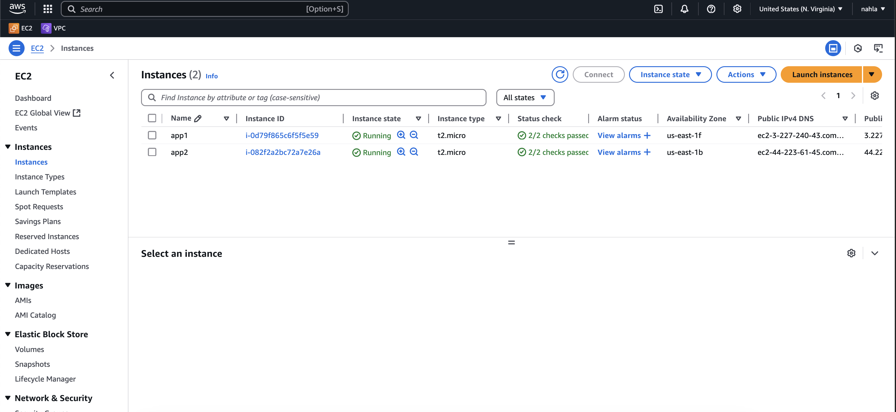
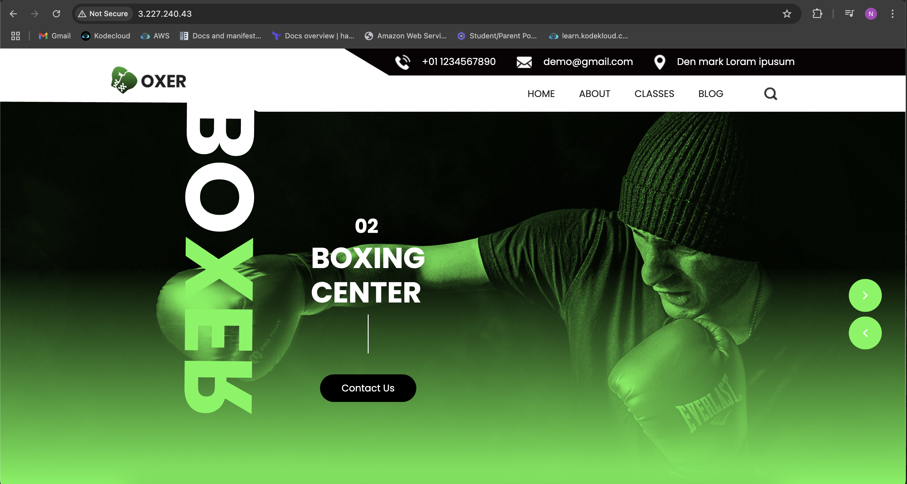
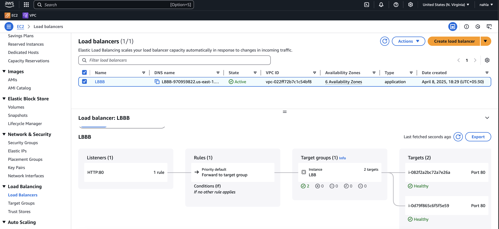
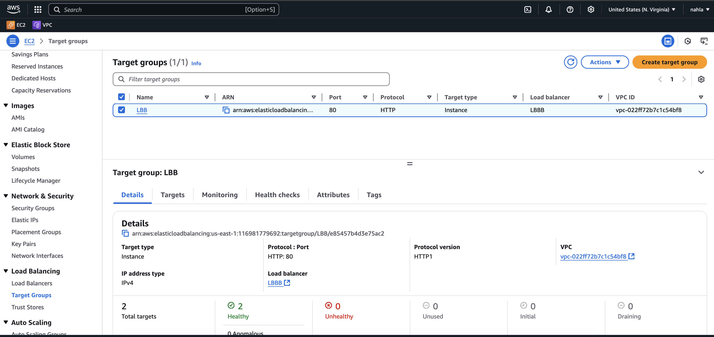

# AWS

### Topic : Load Balancer

#### 1-Launch 2 Instance in different Availability zones

#### 2-Host website on each instances

#### 3-Create Load Balancer with same vpc ,define the AZ and security group of instances
#### 4-Listener -HTTP Port 80

#### 5-Create Target group and attach 2 instances
#### 6-Now attach Target group with load balancer

#### 7-Once the status of load balancer is active,copy the DNS and run it
