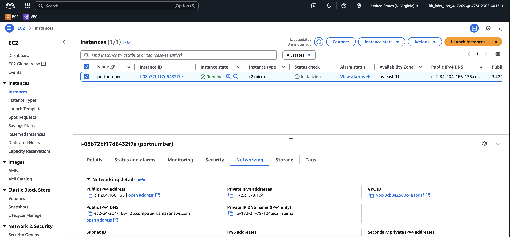
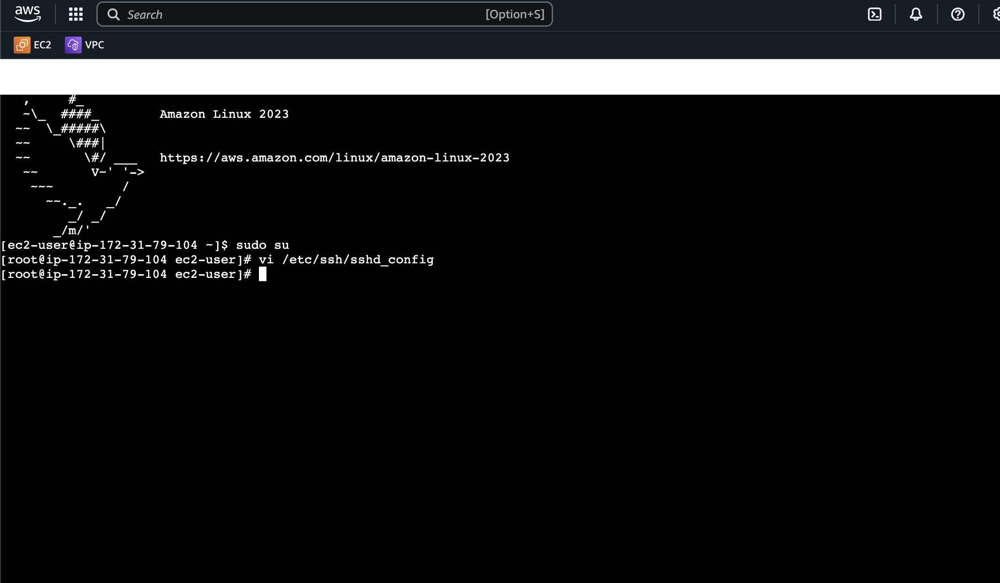
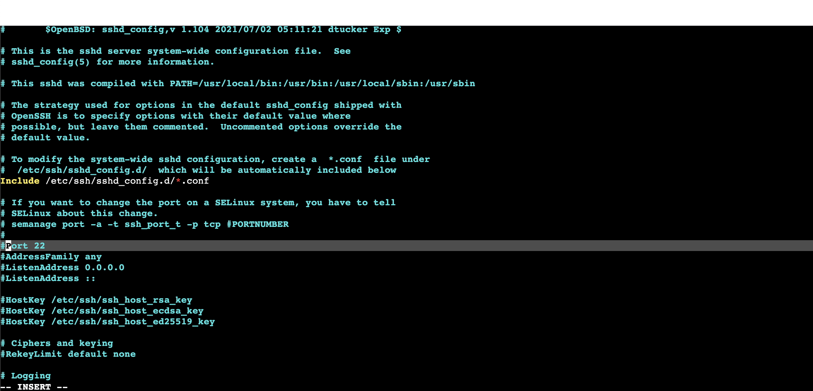
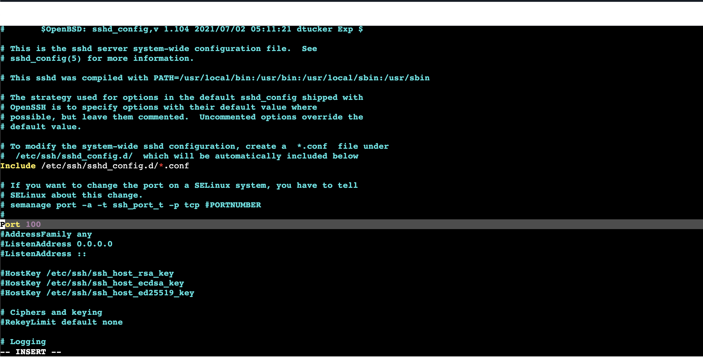
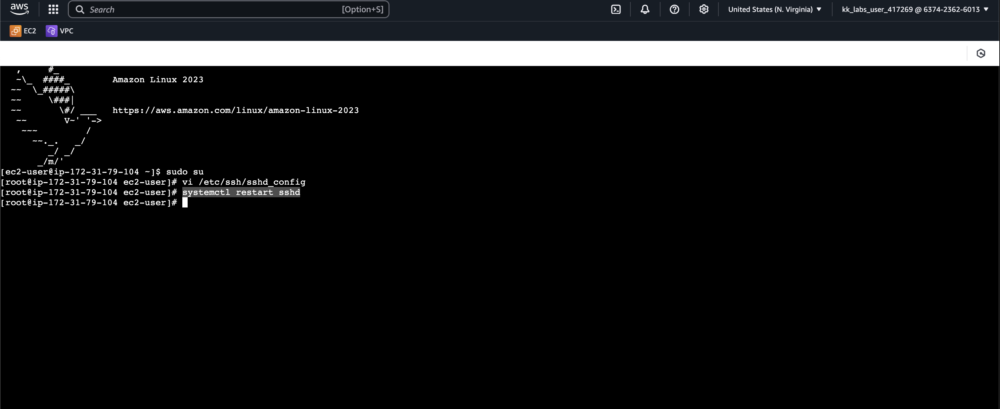
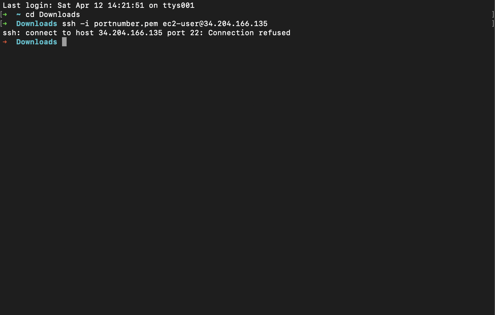
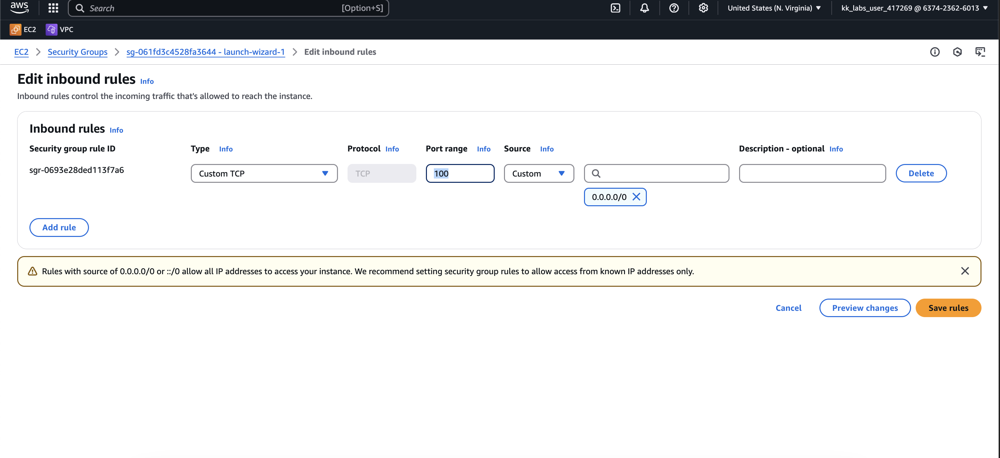
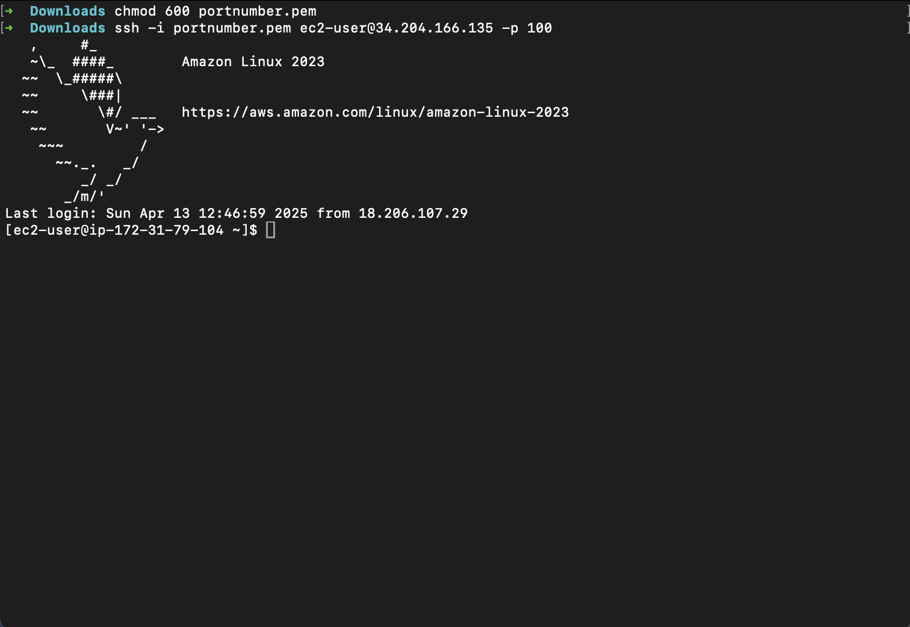

# AWS

### Topic : Port Number Changing

#### How to change default port ssh 22 to a custom port

#### 1-Launch an Instance

#### 2-Connect to the instance
#### 3-Login as root user
#### 4-Open the config file and change the ssh port number from 22 to 100

#### 5-Restart the service

#### 6-Login the instance through terminal.Shows connection refused.

#### 7-After that update the security group of the instance 

#### 8-Now connect to custom port 100 instead of the default SSH port (22).Shows connection established

