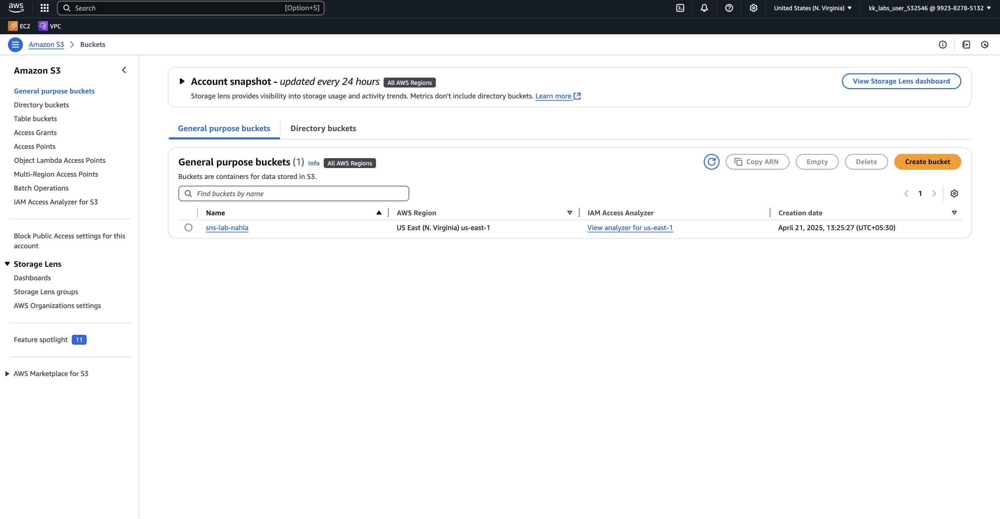

# AWS

### Topic : SNS

#### SNS notification when uploads an object in a bucket

#### 1-Create an s3 bucket

#### 2-Create a SNS topic(channel) and update the access policy(to provide permission to receive notification)

#### 3-Create an event notification with the following configuration shown in image

#### 4-Since the subscriber need to subscribe create a subscription and confirm it

#### 5-Once the subscription is confirmed upload an object in the bucket.

#### 6-An email notification triggered with all the details
